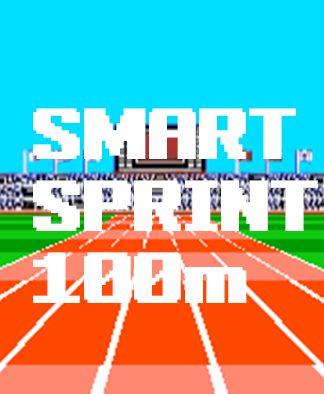
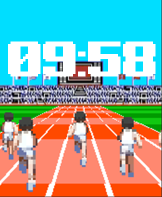
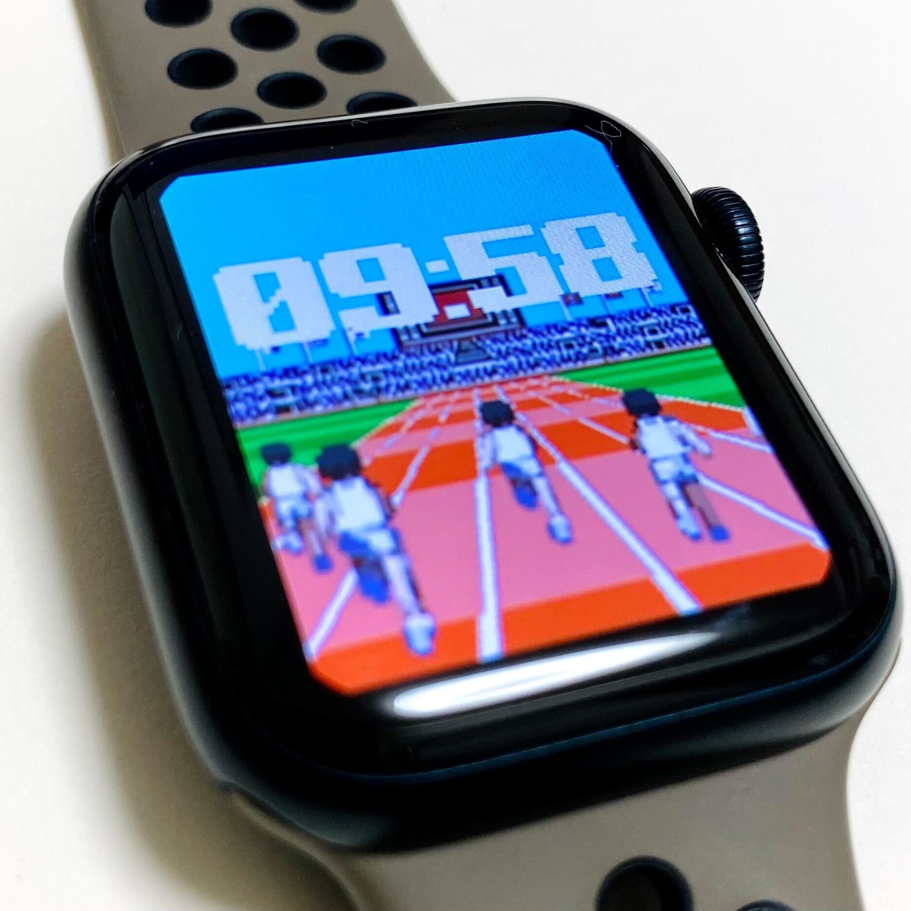

# Smart Sprint 100m

ゲームの概要

Smart Sprint 100mは、Apple Watch専用の簡単操作ランニングゲームで、運動と競技を楽しめる新しい形式のアプリです。手首の動きをトラッキングして仮想の100mスプリントに挑戦し、リアルタイムフィードバックで速度や距離を確認しながら競走を行います。さらに、Apple Watchの時計機能と連動して、世界中のプレイヤーと同時刻にスタートし、競争するモードが搭載されています。

自己ベストや世界ランキングを確認できるランキング機能があり、競争心をくすぐります。また、アバターやランニングシューズなどのカスタマイズ要素で個性を表現できます。

遊びながら運動もできるので、健康的なライフスタイルに役立ちます。
Smart Sprint 100mは、手軽に運動や競技を楽しみたい方にピッタリなゲームです！

